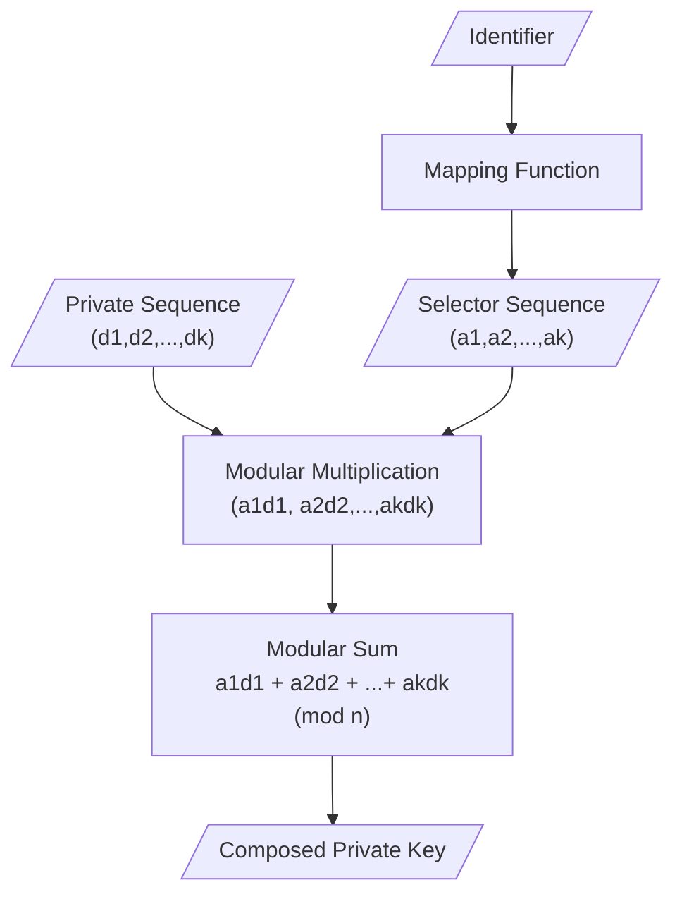
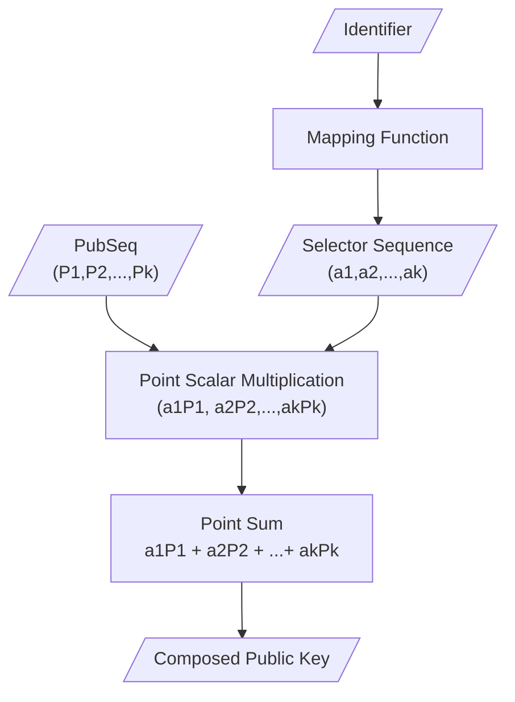

# Combined Public Key Algorithm
- The combined public key algorithm (CPK) is an identity-based large-scale key management algorithm. 
- It can be used on any system that uses public key cryptography that has a special composite property. 
- Because typical blockchain systems use elliptic curve cryptography, which has this special composite property, the combined public-key algorithm can be applied to blockchain wallets to solve large-scale key management problems.

 ## Algorithm
 Let
 $$
\begin{align}
PrivateSequence &= (d_1,d_2,\dots,d_𝑘) \\
PublicSequence &= (P_1,P_2,..,P_𝑘)=(d_1𝐺,d_2𝐺,\dots,d_𝑘𝐺) \\
T &= Identifier \\
SelectorSequence &= (a_1,a_2,\dots,a_k) = Mapping(T)\\
\end{align}
$$
Then
 $$
\begin{align}
ComposedPrivKey_i &= \sum_{j=1}^{k}a_id_i \pmod{n} \\
ComposedPubKey_i &= \sum_{j=1}^{k}a_iP_i
\end{align}
$$

---
## Flowchart
### Composed Private Key Generation

### Composed Public Key Generation

## See Also
1.[CPK Blockchain Wallets](./CPK%20Blockchai%20Wallets.md)